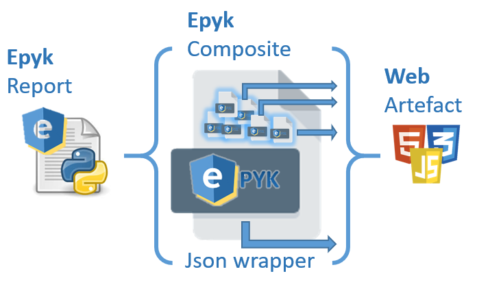

### Epyk with Materials UI!

An easy way to use Epyk with the Material Components extension.

Presentation
================================
This package will make a simple interface between most of the components of Materials components
and Epyk. This addon will allow you to benefit from the two world and to keep write Interactive and modern web pages from Python.

https://material-ui.com/

Concept
=======

Wrapper on top of the Epyk core module to add extra features and shortcuts on Material web components.

Those components are only wrapped on top of generic Epyk components (Epyk Composite component) and this will ensure
interaction between those components.

    

More details on those components are directly available on the [official website](https://material-ui.com/getting-started/installation/) 

This will only provide easy wrappers and automated way to add standard actions from Python.
More complex or bespoke logic might require improvements in this library.

Architecture
============

Composite components are fast macro components composed by elementary bricks in the Epyk core framework.
Those macro components can be configured based on Python dictionary and they will be created on the fly.

This feature is usefull when wrapping exiting new components without any specific logic to be added to.

If more information are required it is better to use Pyk architecture

Usage
=======

To use this extra package, it is required to import it directly. it will use Epyk core module as underlying and this
wrapper will add material entry point to the page object.

This entry point will be the one to rely on the various components.

